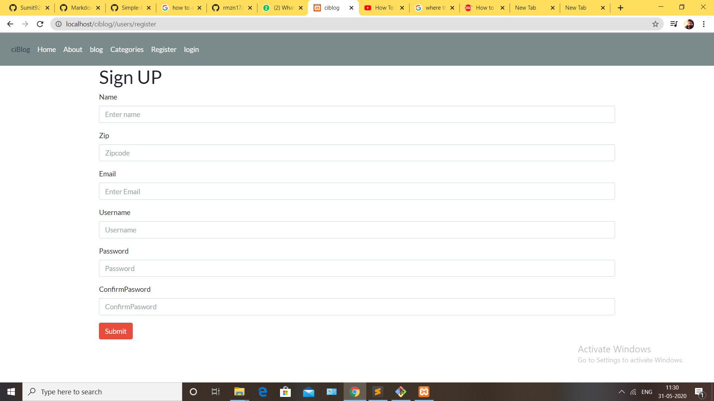
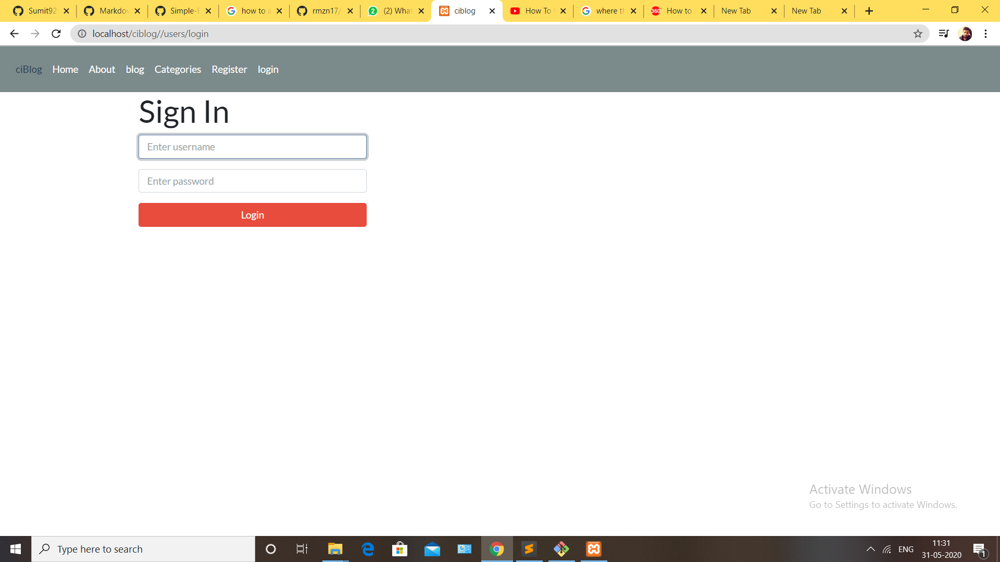
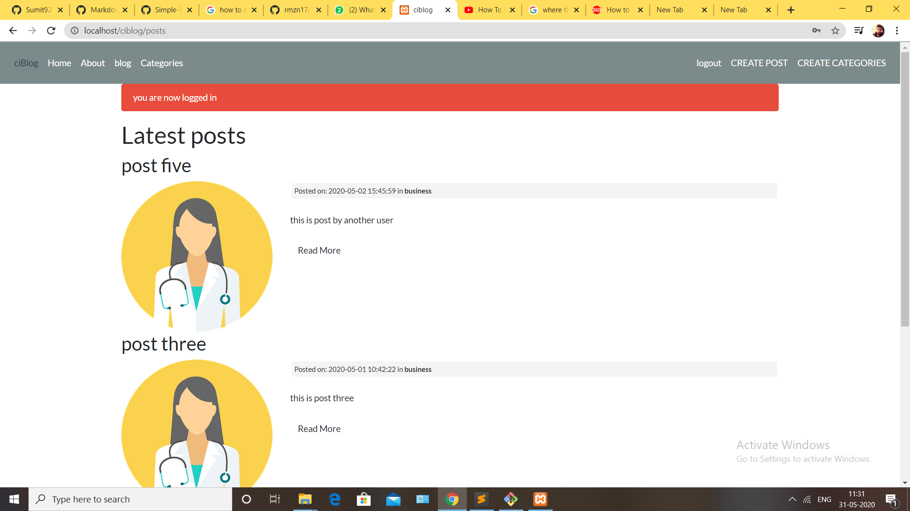
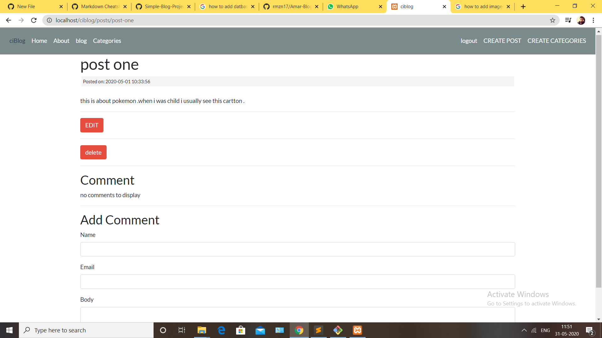

# CodeIgniter-Blog-Website
CodeIgniter is famous for its clear documentation. I recommend you to go through the documentation
at CodeIgniter User Guide(https://codeigniter.com/userguide3/index.html) 
CodeIgniter is an Application Development Framework - a toolkit 

I have created a Codeigniter framework called “Simple Blog-website  in Codeigniter”. 
CodeIgniter follows MVC (Model, View and Controllers)

## Used Language and Framework:
1. PHP
2. codeignitor framework
3. HTML
4. CSS and bootstrap

# some screenshot of my blog website

1. ### for user signup/registration page

2. ### user login page 

3. ### After login user can view the post  and get a flash message .
   
  
4. ### user can comment in any post but  can delete/edit on only their own respective posts.
   
